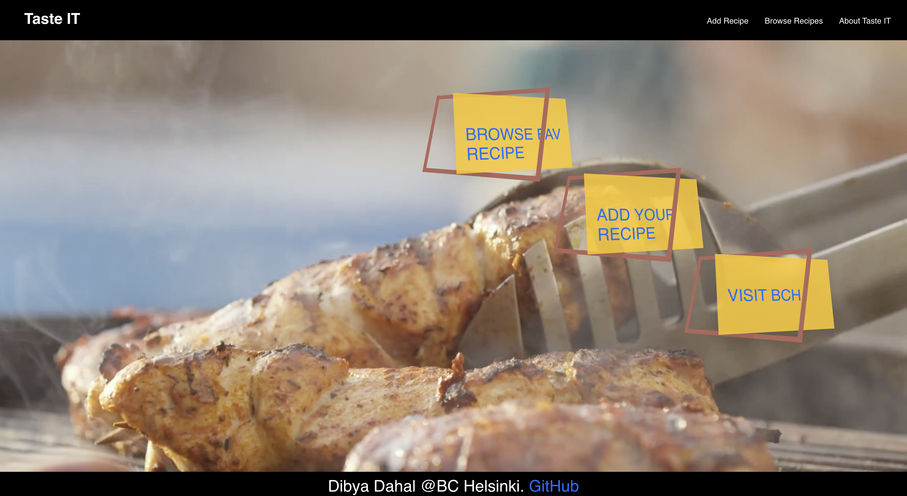
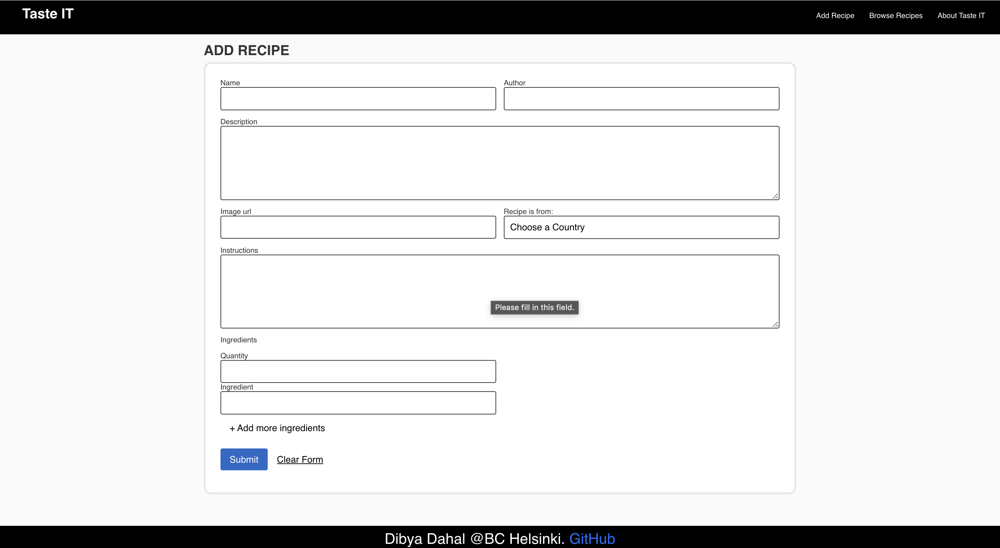
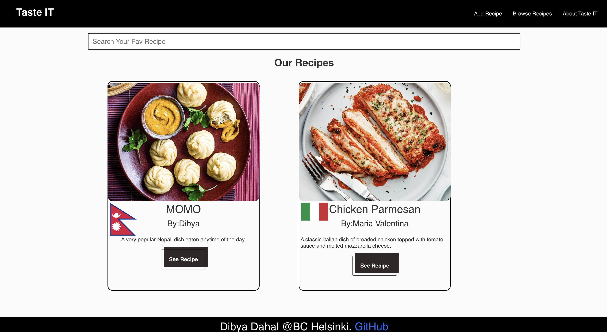
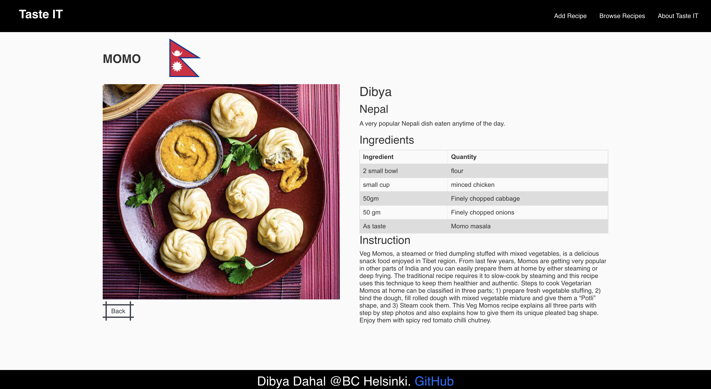

# TasteIT- Built on React

#### The project was an assignment of react course(Teacher: Margit Tennosaar).

#### User can add recipe from their country and also, browse recipes from the database.

#### To add recipe user have to fill form with required details

## To run the app

* npm i (to install node modules)
* npm start
* npm run server(in new terminal)

## Build using:
* HTML
* CSS
* React JS
* Node

## Home Screen 

## Add Recipe

## Recipe List

## Single Recipe

## Github Link
## [Press Me](https://github.com/Killerbee7/TasteIT)

